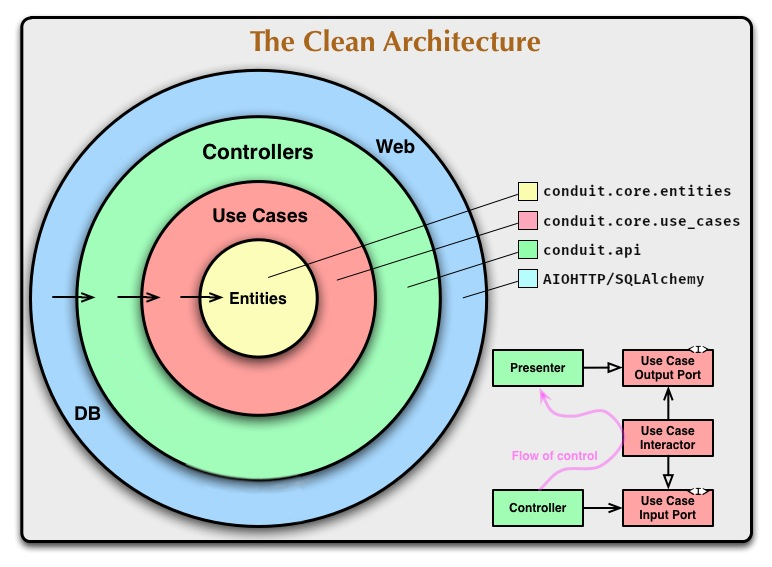

# 


> ### Python / AIOHTTP codebase containing real world examples (CRUD, auth, advanced patterns, etc) that adheres to the [RealWorld](https://github.com/gothinkster/realworld) spec and API.


### [Demo](https://demo.realworld.io/)&nbsp;&nbsp;&nbsp;&nbsp;[RealWorld](https://github.com/gothinkster/realworld)


This codebase was created to demonstrate a fully fledged backend application built with **[AIOHTTP](https://docs.aiohttp.org/en/stable/)** including CRUD operations, authentication, routing, and more.

For more information on how this works with other frontends/backends, head over to the [RealWorld](https://github.com/gothinkster/realworld) repo.


# Getting started

Ensure that you have Docker installed on your system. Clone the repository and switch to the main branch. 
To run end-to-end tests, use the following command:
```bash
make e2e-tests
```

This command will build, pull, and start the necessary containers required for the end-to-end tests.

The OpenAPI Specification is available on http://localhost:8080/api/docs

To stop the running containers:
```bash
make down
```

# How it works
This implementation follows the principles of [the Clean Architecture](https://blog.cleancoder.com/uncle-bob/2012/08/13/the-clean-architecture.html)
and highly inspired by the fantastic book [Architecture Patterns with Python](https://www.cosmicpython.com/).



The `conduit.core` package does not depend on any infrastructural concerns. It represents the business logic of
the application. Implementations of all API endpoints are located in the `conduit.api` package. These implementations
use `UseCase` classes from the `conduit.core` to perform business logic.

# Packages
The project uses the following packages:
* [AIOHTTP](https://github.com/aio-libs/aiohttp) - Asynchronous HTTP Client/Server for asyncio and Python.
* [SQLAlchemy](https://www.sqlalchemy.org/) - The Python SQL Toolkit and Object Relational Mapper.
* [asyncpg](https://github.com/MagicStack/asyncpg) - A fast PostgreSQL Database Client Library for Python/asyncio.
* [Dependency Injector](https://python-dependency-injector.ets-labs.org/) - Dependency injection framework for Python.
* [Dynaconf](https://www.dynaconf.com/) - Configuration Management for Python.
* [structlog](https://www.structlog.org/en/stable/) - The production-ready logging solution for Python.
* [mypy](https://mypy-lang.org/) - Optional static typing for Python.
* [Ruff](https://docs.astral.sh/ruff/) - An extremely fast Python linter and code formatter, written in Rust.
* [pytest](https://docs.pytest.org/en/latest/) - A mature full-featured Python testing tool that helps you write better programs.
